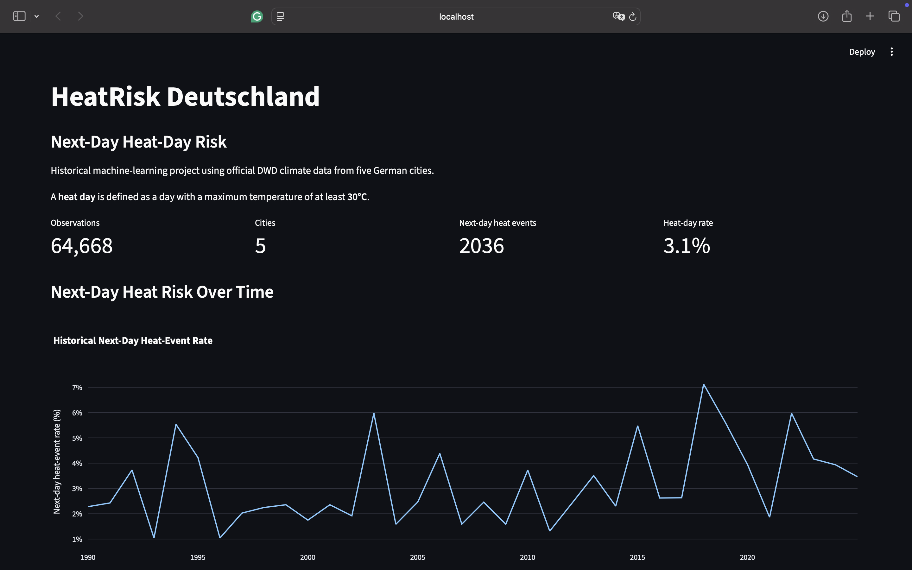
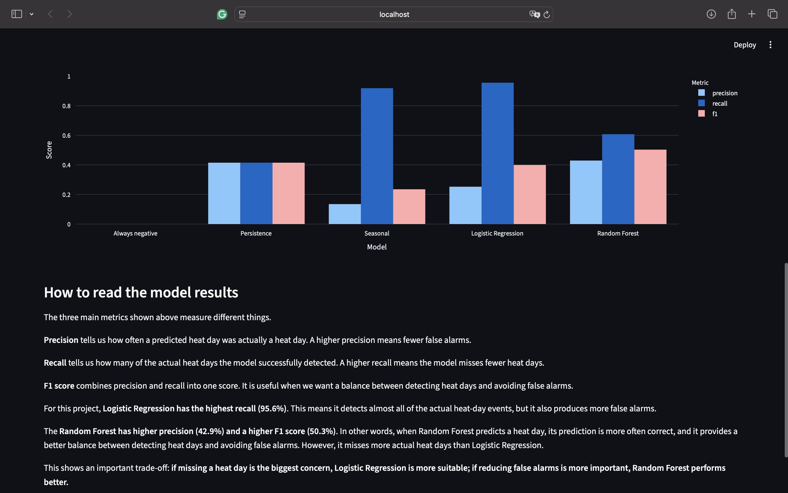

# HeatRisk Deutschland

**Time-series machine-learning project for predicting next-day heat-day risk using official DWD climate data.**

A heat day is defined as a day with a maximum temperature of **≥ 30°C**.

The project uses daily observations from **five German cities** and compares simple baselines with **Logistic Regression** and **Random Forest** using chronological train/validation/test splits.

## Dashboard

<!-- Add dashboard screenshot here -->




## Key Finding

The models show a trade-off between **detecting heat days** and **avoiding false alarms**.

**Logistic Regression** achieved the highest recall (**95.56%**), detecting 129 of 135 actual heat-day events. However, it produced more false alarms.

**Random Forest** achieved higher precision (**42.93%**) and a higher F1 score (**50.31%**), providing a better balance between precision and recall, but it missed more heat-day events.

This means Logistic Regression is preferable when **missing a heat day is the main concern**, while Random Forest is preferable when **reducing false alarms is more important**.

## Test Results

| Model | Accuracy | Precision | Recall | F1 |
|---|---:|---:|---:|---:|
| Always Negative | 96.30% | 0.00% | 0.00% | 0.00% |
| Persistence | 95.67% | 41.48% | 41.48% | 41.48% |
| Seasonal | 77.89% | 13.48% | 91.85% | 23.51% |
| Logistic Regression | 89.37% | 25.24% | **95.56%** | 39.94% |
| Random Forest | 95.56% | **42.93%** | 60.74% | **50.31%** |

Because heat days are relatively rare, **accuracy alone is misleading**. The Always Negative baseline reaches 96.30% accuracy while detecting zero heat days.

## Method

**Data:** Official DWD daily climate observations from Berlin, Frankfurt, Hamburg, München and Köln, using data from 1990 onwards.

**Target:** Whether the following day reaches `TXK ≥ 30°C`.

**Features:**

- Mean, maximum and minimum temperature
- Vapor pressure
- Relative humidity
- Previous-day maximum temperature
- Three-day rolling maximum temperature

**Evaluation:** Chronological split:

```text
Train:       1990–2020
Validation:  2021–2023
Test:        2024–2025
```

No future observations are used to construct prediction features.

## Project Structure

```text
heatrisk-deutschland/
├── app/
│   └── streamlit_app.py
├── data/raw/
├── outputs/
├── scripts/
├── src/
│   ├── baseline.py
│   ├── data_loader.py
│   ├── evaluation.py
│   ├── features.py
│   ├── models.py
│   └── split.py
├── requirements.txt
└── README.md
```

## Run Locally

```bash
git clone https://github.com/amk0098/heatrisk-deutschland.git
cd heatrisk-deutschland

python3 -m venv .venv
source .venv/bin/activate

python -m pip install -r requirements.txt
```

Run the evaluation:

```bash
python -m src.evaluation
```

Launch the dashboard:

```bash
python -m streamlit run app/streamlit_app.py
```

## Tech Stack

**Python · pandas · scikit-learn · matplotlib · Plotly · Streamlit · Git/GitHub**

## Limitations

This is a **historical ML prototype**, not a production weather forecast.

Only five stations are included, so the results do not represent every German microclimate. Model performance may also vary during rare extreme-weather events.

## Data Source

Climate data is provided by the **German Weather Service (DWD)** through the DWD Climate Data Center (CDC).

https://www.dwd.de/

https://opendata.dwd.de/climate_environment/CDC/

---

### Kurzfassung auf Deutsch

**HeatRisk Deutschland** ist ein Time-Series-Machine-Learning-Projekt zur Vorhersage des Hitzetags am folgenden Tag auf Basis offizieller DWD-Klimadaten.

Ein Hitzetag wird als Tag mit einer maximalen Temperatur von mindestens **30°C** definiert. Das Projekt verwendet Daten aus fünf deutschen Städten und vergleicht Baselines, Logistische Regression und Random Forest.

Die Logistische Regression erreicht den höchsten Recall (**95,56 %**) und erkennt damit fast alle tatsächlichen Hitzetage. Der Random Forest erreicht dagegen eine höhere Precision (**42,93 %**) und einen höheren F1-Score (**50,31 %**).

Das Projekt ist ein **historischer ML-Prototyp und keine produktive Wettervorhersage**.